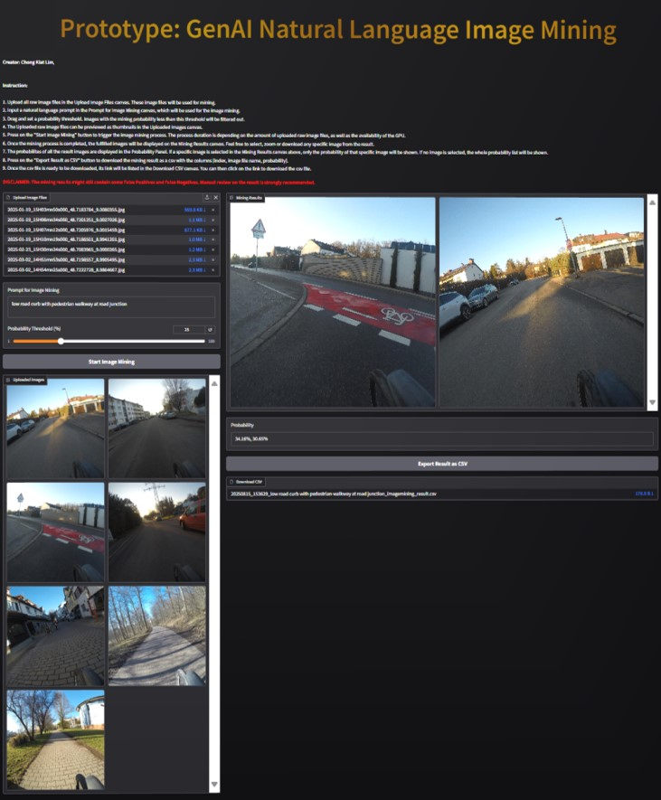

# GenAI Natural Language Image Mining

**Author: Chong Kiat Lim**

---

An application that utilizes multi-modal Generative AI models to search and mine images using natural language prompts. Upload a batch of images, describe what you're looking for in plain English, and the system returns matching images ranked by relevance probability.




---

## Variant Comparison: CLIP-Only vs CLIP + YOLOv5

| Aspect | CLIP-Only (`GenAI_Image_Search_application.py`) | CLIP + YOLOv5 (`GenAI_Image_Search_application_YOLOv5.py`) |
|--------|------------------------------------------------|-----------------------------------------------------------|
| **Models** | CLIP only | CLIP + YOLOv5 |
| **Similarity method** | Joint text-image processing → `logits_per_image` → softmax across all images | Separate embeddings → cosine similarity per image |
| **Scoring** | Softmax probabilities (relative — all images sum to ~100%) | Cosine similarity (absolute — each image scored independently) |
| **Object detection** | None | YOLOv5 detects objects in each image before CLIP comparison |
| **UI** | Full Gradio Blocks (gallery, thumbnails, CSV export, file upload) | Simple `gr.Interface` (basic inputs/outputs) |
| **Features** | Thumbnails, CSV export, probability panel, image selection events | Minimal — gallery + text output only |
| **Embedding approach** | CLIP processes text + images together in one forward pass | CLIP extracts text features and image features separately, then computes cosine distance |

**Key practical difference**: The CLIP-only version gives *relative* rankings (probabilities redistribute if you add/remove images). The YOLOv5 version gives *absolute* similarity scores per image, making it more stable for threshold-based filtering regardless of batch size.

---

## Features

- Natural language image search using CLIP multi-modal AI
- Two variants: CLIP-only and CLIP + YOLOv5 hybrid
- Adjustable probability threshold filtering
- Image thumbnail preview
- CSV export of results with probabilities
- Dark-themed responsive web interface
- GPU acceleration (automatic CUDA detection)
- Configurable models via environment variables

---

## Quick Start

```bash
# Create and activate virtual environment
python -m venv .genai_imagesearch_venv
.\.genai_imagesearch_venv\Scripts\activate  # Windows

# Install dependencies
pip install -r requirements.txt

# Run the application
python GenAI_Image_Search_application.py
```

---

## Implementation Details

See [IMPLEMENTATION.md](IMPLEMENTATION.md) for architecture, pipeline details, model configuration, and testing approach.

---

## Usage Guide

See [USAGE.md](USAGE.md) for installation steps, running instructions, workflow walkthrough, and tips.

---

## Project Structure

```
├── GenAI_Image_Search_application.py          # CLIP-only version
├── GenAI_Image_Search_application_YOLOv5.py   # CLIP + YOLOv5 version
├── requirements.txt                           # Python dependencies
├── .env                                       # Environment variable configuration
├── .gitignore                                 # Git ignore rules
├── IMPLEMENTATION.md                          # Implementation documentation
├── USAGE.md                                   # Usage documentation
├── README.md                                  # This file
├── documents/images/                          # Documentation images
└── tests/                                     # Unit tests
    ├── test_image_search.py
    └── test_image_search_yolov5.py
```

---

## Running Tests

```bash
pytest tests/ -v
```

---

## Disclaimer

The mining results might still contain **False Positives** and **False Negatives**. Manual review of the results is strongly recommended.

---

## Tech Stack

| Skill | Description |
|-------|-------------|
| Multi-Modal AI (CLIP) | Leverages OpenAI's CLIP model for joint text-image understanding and semantic similarity computation |
| Object Detection (YOLOv5) | Real-time object detection to enhance image search with object-aware context |
| Vision-Language Embeddings | Generates and compares normalized embeddings across text and image modalities |
| Cosine Similarity Search | Computes vector similarity between prompt embeddings and image embeddings for relevance ranking |
| Softmax Probability Ranking | Applies softmax normalization across image logits for probability-based result ordering |
| GPU-Accelerated Inference | Automatic CUDA detection and device placement for accelerated model inference |
| Image Preprocessing Pipeline | Automated format conversion and normalization for robust multi-format image handling |
| Interactive AI Web Application | Gradio-based real-time web UI for AI model interaction with upload, search, and export workflows |
